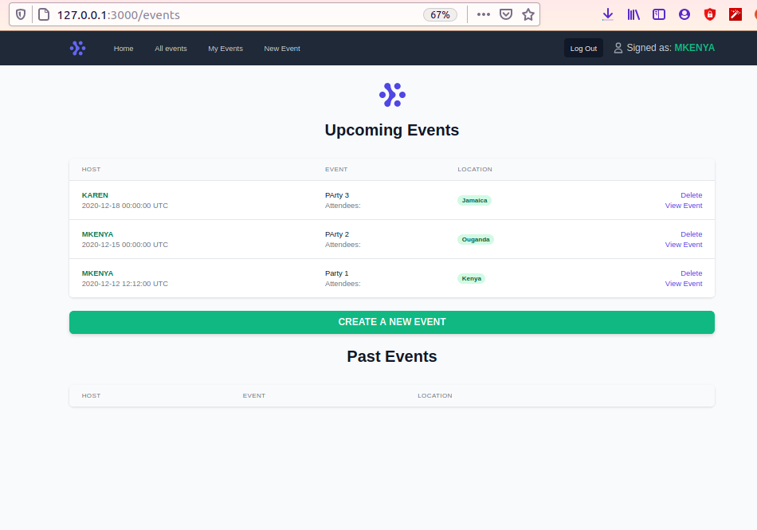

# Private Events

> The project ensures a many-to-many association between Users, Events and Attendances of users to an event. This was achieved through the use of validations, source, through, foreign keys and class name to bring about the active record association supported by rails.

## Built With

- Ruby
- Ruby on Rails
- HTML 5
- Tailwind CSS
- Rubocop
- Rspec

To get a local copy up and running, follow the steps below.

## Prerequisites

> You need to have both ruby and ruby on rails installed on your computer, then proceed with the steps below.

- Clone the project to your local machine; `git clone https://github.com/edxco/PrivateEvents.git`
- `cd` into the project directory; `cd PrivateEvents`
- Install tailwinds 1.9.6 `npm i tailwindcss@1.9.6`
- Run `bundle install` to install the necessary gems;
- Run `yarn install --check files`.
- Run `rails db:migrate` to create your database columns;
- Run `rails s` to start a server in your computer;
- In your browser address, type the following URL: [localhost:3000](localhost:3000);
- You can now create new users who can then create events and also attend the events they created or those created by other users.
- Enjoy the App and its functionalities!

## Authors

### Author 1

👤 **Roy Mukuye**

- GitHub: [@mke2111](https://github.com/mke2111)
- Twitter: [@Roymkenya](https://twitter.com/Roymkenya)
- LinkedIn: [Roy Mukuye](https://www.linkedin.com/in/roy-mukuye-42b07b1b4)

### Author 2

👤 **Eduardo Baeza**

- GitHub: [@edxco](https://github.com/edxco/)
- Twitter: [@lalo_nbc](https://twitter.com/lalo_nbc/)
- LinkedIn: [eduardo-n-baeza](https://www.linkedin.com/in/eduardo-n-baeza/)

## 🤝 Contributing

Contributions, [issues](https://github.com/edxco/PrivateEvents/issues) and feature requests are welcome! Start by:

Forking the project.
Cloning the project to your local machine.
cd into the project directory.
Run git checkout -b your-branch-name.
Make your contributions.
Push your branch up to your forked repository.
Open a Pull Request with a detailed description to the development branch of the original project for a review.

## Show your support

Give a ⭐️ if you like this project!